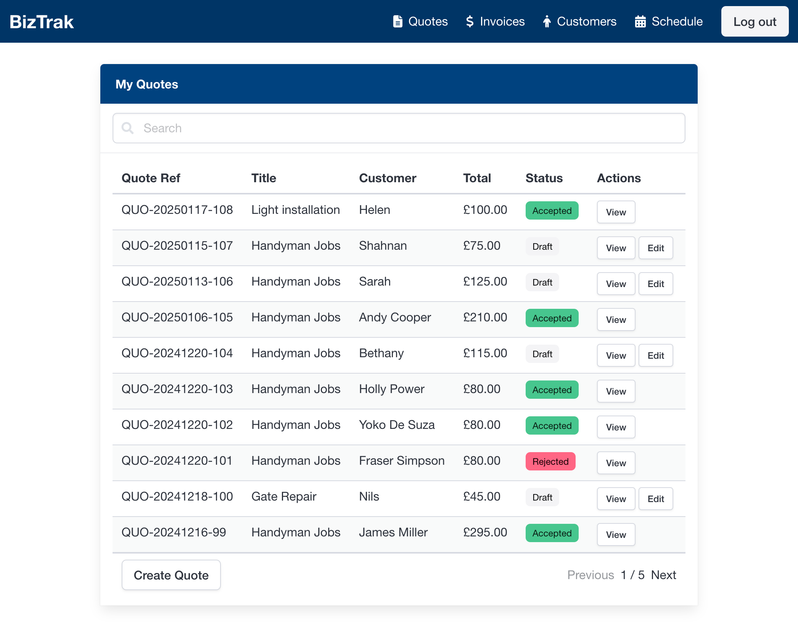
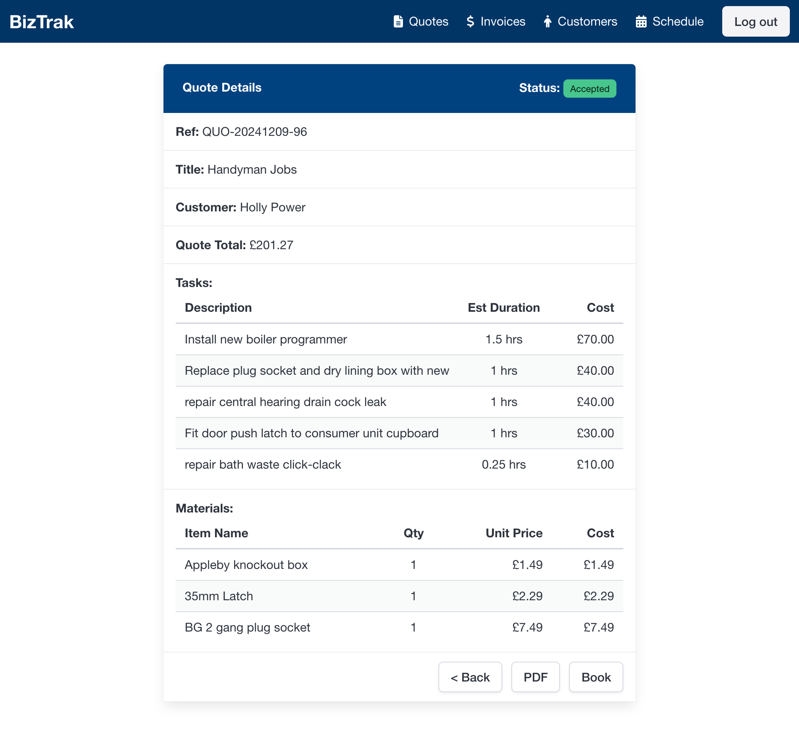

# BizTrak

BizTrak is a comprehensive quote and invoicing management system designed to help businesses streamline their workflow from quote creation to invoicing and payments. Built with **ASP.NET Core** and **Vue.js**, BizTrak offers a modern, efficient, and user-friendly solution for managing business operations.

---

## 🚀 Features

- **Quote Management**
  - Create, edit, and delete quotes with task and material breakdowns.
  - Track quote statuses: Draft, Sent, Accepted, Rejected.
  - Convert quotes to invoices seamlessly.

- **Invoice Management**
  - Generate invoices from accepted quotes.
  - Invoice statuses: New, Sent, Paid, Outstanding.
  - Automatic PDF generation for quotes and invoices.

- **Task and Material Management**
  - Add multiple tasks and materials to quotes and invoices.
  - Calculate total costs dynamically based on quantity and unit price.

- **User Authentication**
  - Secure login system using JWT authentication.
  - Role-based authorization to restrict access to certain features.

- **Pagination & Filtering**
  - Retrieve paginated lists of quotes and invoices.
  - Search and filter by status, client, or date.

- **Responsive Design**
  - Fully responsive UI using **Bulma CSS**, ensuring compatibility across devices.

- **Performance Optimization**
  - Lazy loading of tasks and materials to enhance app speed.
  - Debounced API requests to prevent excessive calls during user interactions.

---

## 🛠️ Technologies Used

**Backend:**
- ASP.NET Core
- Entity Framework Core
- PostgreSQL with Npgsql

**Frontend:**
- Vue.js 3 (Composition API)
- Vuex
- Vuelidate for form validation
- Bulma for styling

**DevOps & Other Tools:**
- Axios for API requests
- Jest for unit testing
- GitHub Actions for CI/CD
- Docker for containerized deployment

---

## ⚙️ Installation & Setup

### Prerequisites

Ensure you have the following installed:

- Node.js and npm
- .NET SDK
- PostgreSQL Database

### Backend Setup

1. Clone the repository:

   ```bash
   git clone https://github.com/yourusername/BizTrak.git
   cd BizTrak/BizTrak.Api
   ```

2. Update the `appsettings.json` with your PostgreSQL connection string.

3. Run the database migrations:

   ```bash
   dotnet ef database update
   ```

4. Start the ASP.NET Core API:

   ```bash
   dotnet run
   ```

### Frontend Setup

1. Navigate to the frontend directory:

   ```bash
   cd BizTrak/BizTrak.Web
   ```

2. Install dependencies:

   ```bash
   npm install
   ```

3. Run the development server:

   ```bash
   npm run dev
   ```

4. Open the app in your browser at `http://localhost:5173`

---

## 🤖 Running Tests

### Unit Tests (Vue 3 + Jest)

To run frontend tests:

```bash
cd BizTrak/BizTrak.Web
npm run test:unit
```

### Backend Tests (ASP.NET Core xUnit)

To run backend tests:

```bash
cd BizTrak/BizTrak.UnitTests
dotnet test
```

---

## 📚 API Documentation

BizTrak provides a comprehensive API for managing quotes, invoices, tasks, and materials. To access the API documentation:

1. Start the backend server.
2. Visit `http://localhost:5000/swagger` in your browser.

---

## 🖼️ Screenshots

### Quote List View


### Quote Details View


### Quote Edit View


### Scheduler View

---

## 🔒 Security

- JWT-based authentication is implemented for secure access.
- Ensure environment variables are properly set for sensitive data such as API keys and database credentials.

---

## 🛡️ License

This project is licensed under the MIT License - see the [LICENSE](LICENSE) file for details.

---

## 💎 Contact

If you have any questions or need support, please contact:

- **Stuart Kinlochan**  
- GitHub: [@stuartkinlochan](https://github.com/stuartkinlochan)

---

